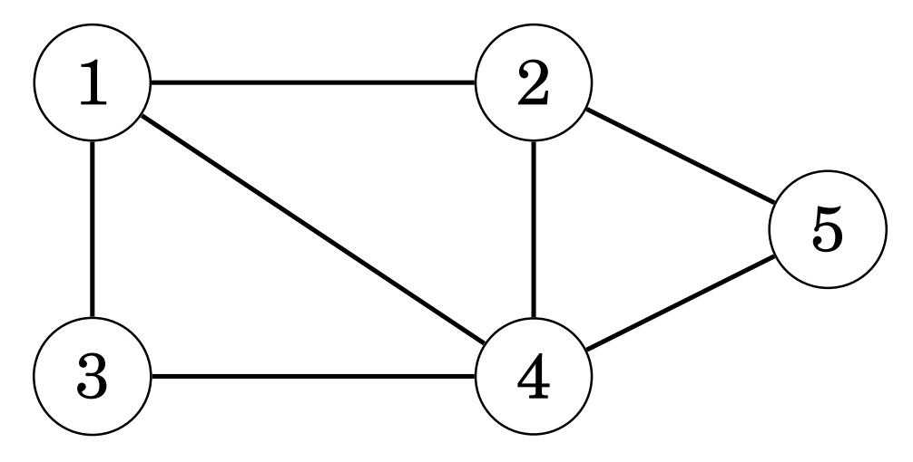
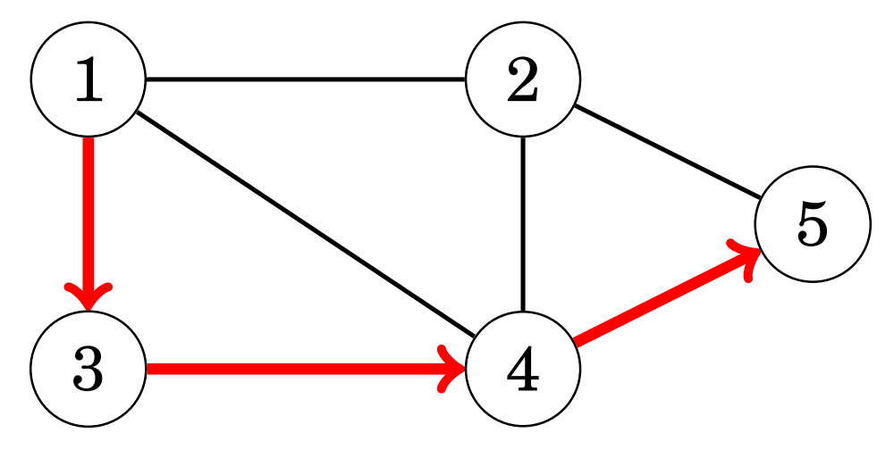
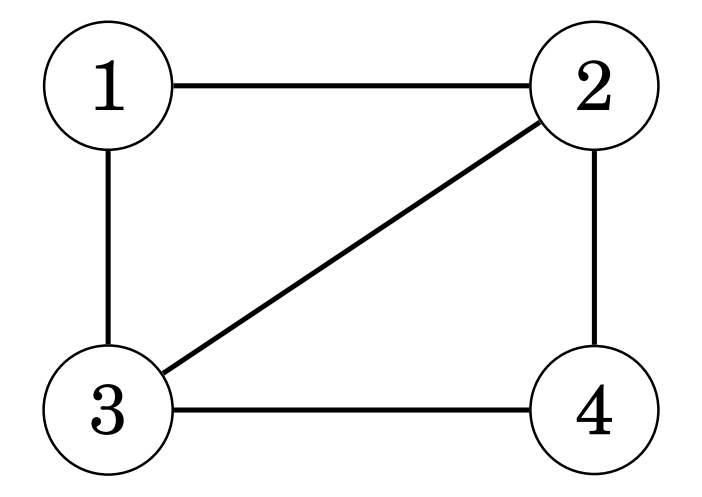
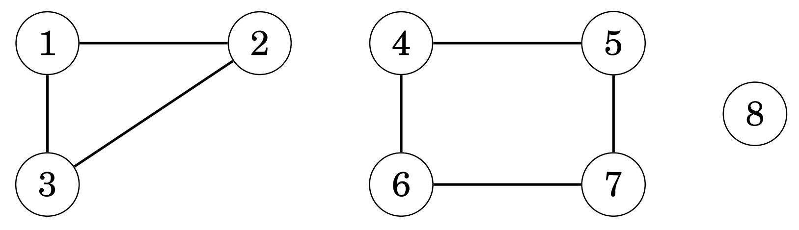
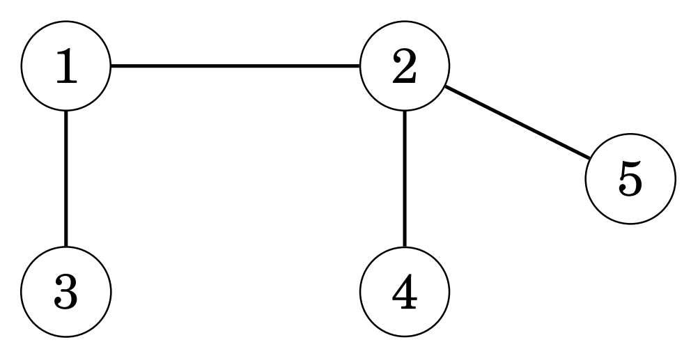
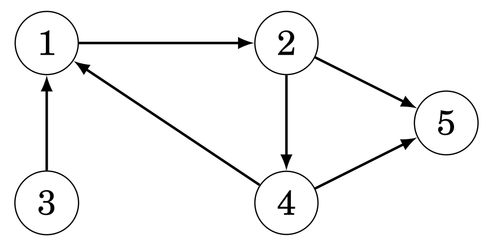
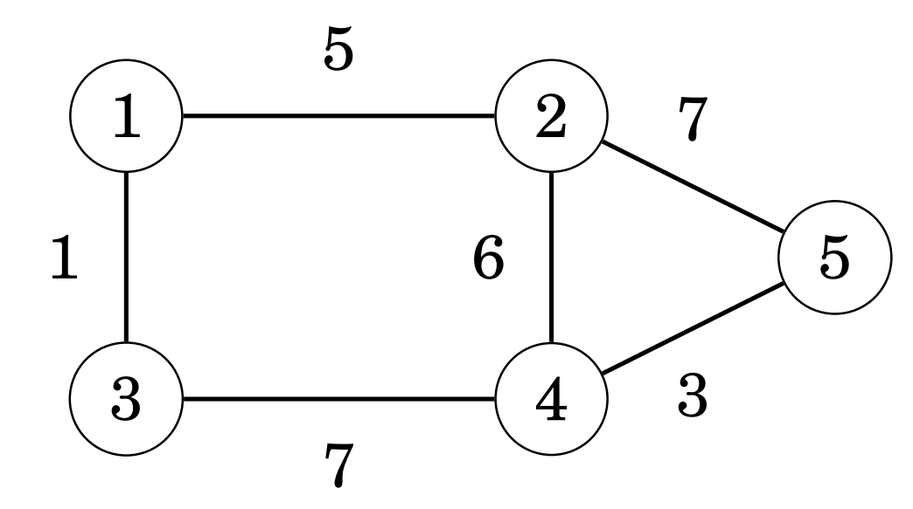

# 그래프의 기초 개념

어떤 프로그래밍 문제는 그 문제를 그래프 문제로 생각하고 적절한 그래프 알고리즘을 사용했을 때 더 쉽게 풀리는 경우가 많다.
그래프의 대표적인 예로는 여러 개의 도시와 그 도시들을 잇는 여러 개의 도로들로 이루어진 연결망 (network)를 들 수 있다.

## 꼭짓점, 간선과 경로
그래프는 꼭짓점 (node)과 간선 (edge)로 이루어진다. 아래의 그림은 5개의 꼭짓점과 7개의 간선으로 이루어진 그래프이다.

그래프에서 꼭짓점 `a`와 꼭짓점 `b`를 잇는 여러 개의 간선을 경로 (path)라고 하며, 하나의 경로에 포함된 간선의 개수를 
그 경로의 길이 (length)라고 한다. 아래의 그래프에서 표시된 경로의 길이는 `1 + 1 + 1 = 3`이다.

## 순환 경로와 단순 경로

첫 번째 꼭짓점와 마지막 꼭짓점이 같은 경로를 순환 (cycle) 경로라고 부르고, 첫 번째 꼭짓점과 마지막 꼭짓점이 다른 경로를 
단순 (simple) 경로라고 한다.

## 연결 그래프

그래프에서 모든 꼭짓점이 적어도 한 개의 간선과 연결되어 있는 경우, 이 그래프를 연결 그래프 (connected graph)라고 하며,
그래프에서 연결되어 있는 각각의 꼭짓점 집합을 그래프의 구성 요소 (components)라고 한다.

아래 그래프의 구성 요소는 `{1, 2, 3}`, `{4, 5, 6, 7}`, `{8}` 이렇게 3개이다.

연결 그래프 중에서 특히 `n`개의 꼭짓점와 `n - 1`개의 간선을 가진 그래프를 트리 (tree)라고 한다.

## 유향 그래프와 가중 그래프

그래프를 구성하는 모든 간선이 방향을 가질 때, 이 그래프를 유향 그래프 (directed graph)라고 하고, 그래프를 구성하는
모든 간선이 가중치 (weight)를 가지는 그래프를 가중 그래프 (weighted graph)라고 한다. 가중 그래프에서 간선의 가중치는
그 간선의 길이 정도로 생각할 수 있다.

## 이웃과 차수

두 개의 꼭짓점 사이에 간선이 하나 이상 존재하는 경우를 두 꼭짓점이 이웃 (neighbor) 또는 인접 (adjacent)한다고 말하고, 
하나의 꼭짓점이 가지는 이웃 꼭짓점의 개수는 그 꼭짓점의 차수 (degree)라고 한다. 아래 그래프에서 꼭짓점 `2`의 이웃은
`1`, `4`와 `5`이기 때문에 이 꼭짓점의 차수는 3이 된다.

그래프에서 모든 꼭짓점의 차수를 합하면 항상 간선의 개수의 2배가 되는데, 이는 하나의 간선이 두 개의 꼭짓점의 차수를 동시에 
하나씩 증가시키기 때문이다. 이러한 이유 때문에 그래프 차수의 합은 항상 짝수가 된다. 모든 꼭짓점의 차수가 같은 그래프를 
정규 그래프 (regular graph)라고 하며, 그래프의 모든 꼭짓점이 연결되어 있는 그래프를 완전 그래프 (complete graph)라고 한다. 
유향 그래프에서 꼭짓점의 진입 차수 (in-degrees)는 그 꼭짓점으로 들어오는 간선의 개수를 말하고, 진출 차수 (out-degrees)는 
꼭짓점에서 나가는 간선의 개수를 말한다. 아래 그래프에서 꼭짓점 `2`의 진입 차수는 2, 진출 차수는 1이다.

