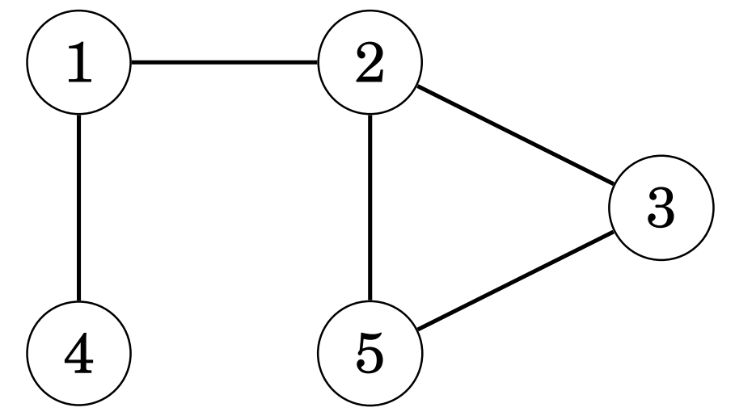
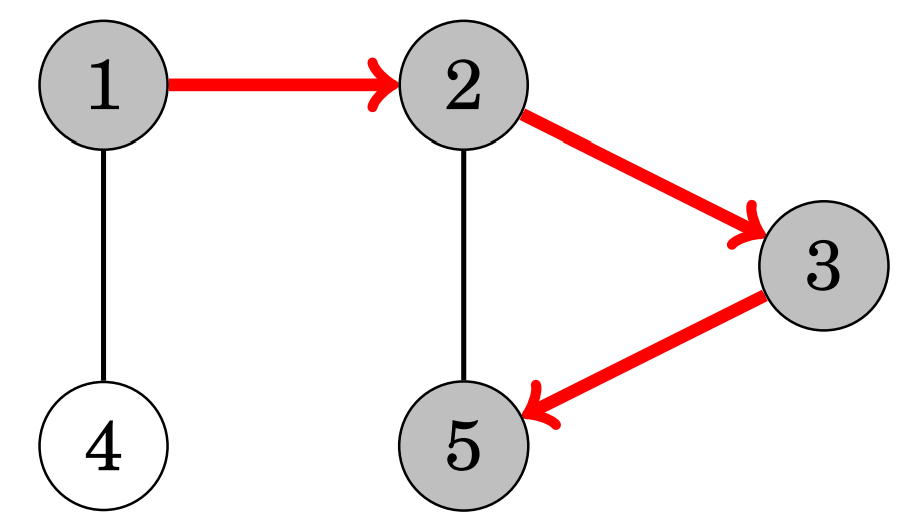
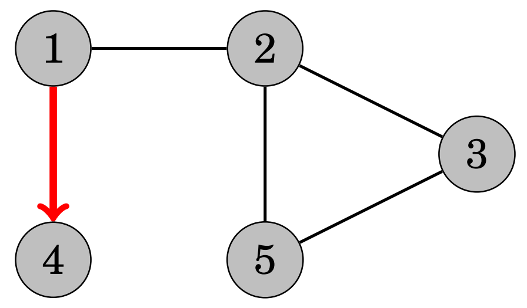
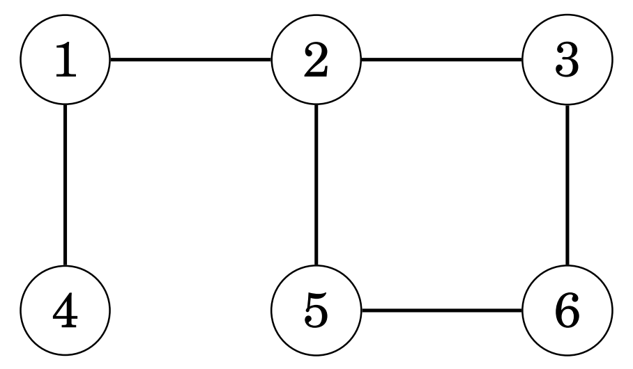
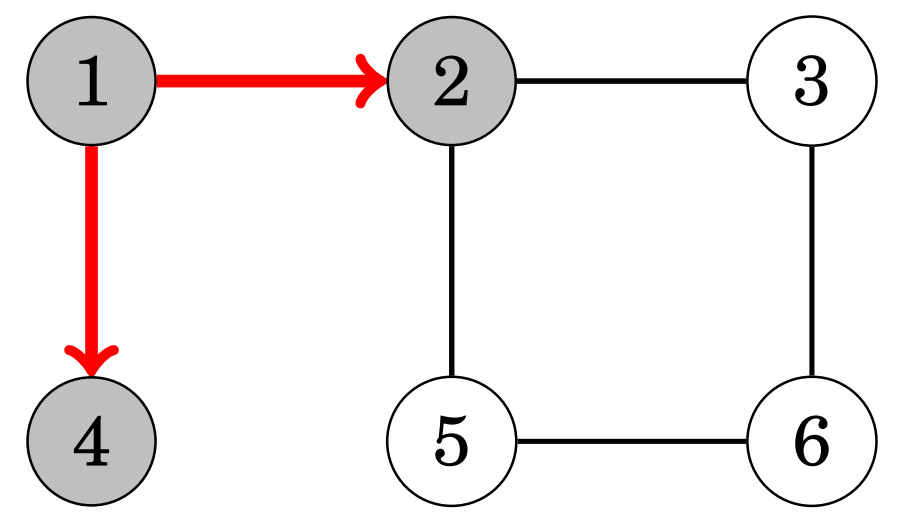
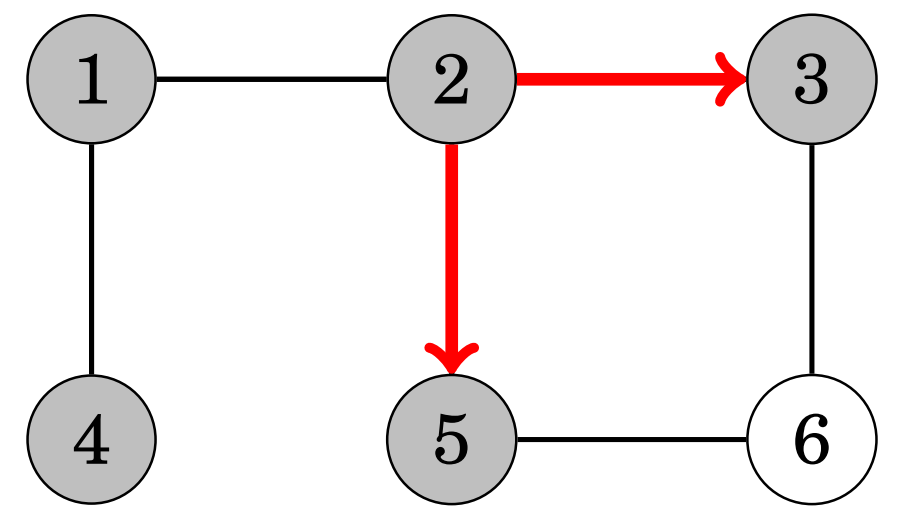
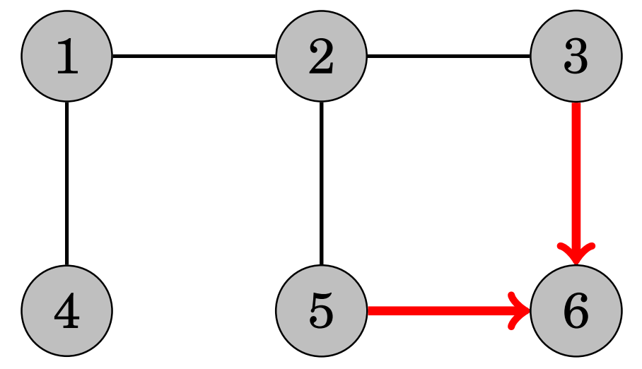

# 그래프 탐색

깊이 우선 탐색 (depth-first search, DFS)와 너비 우선 탐색 (breadth-first search, BFS)는 그래프 탐색에 사용되는 가장 
기초적인 알고리즘으로, 그래프의 특정 꼭짓점에서 시작해 그 꼭짓점에서 갈 수 있는 모든 꼭짓점의 경우의 수를 찾는 
알고리즘이다. 두 알고리즘의 차이는 각 꼭짓점을 방문하는 순서에 있다.

## 깊이 우선 탐색

깊이 우선 탐색은 이해하기 쉽고 직관적인 그래프 탐색 알고리즘이다. 이 알고리즘은 시작 지점 아래의 하나의 경로에서 시작해
경로 아래의 모든 꼭짓점을 찾을 때까지 계속 내려간다. 모든 꼭짓점을 찾은 다음에는 다시 시작 지점 아래의 또다른 경로를 
탐색하며 모든 꼭짓점을 찾아낸다. 알고리즘은 탐색이 끝난 꼭짓점을 모두 저장하며 한번에 하나의 꼭짓점만 처리한다.

다음 그래프에서 깊이 우선 탐색이 어떻게 진행되는지 직접 확인해보자.



첫 번째 꼭짓점에서 탐색을 시작한다고 할 때, 알고리즘은 오른쪽 경로를 따라 맨 끝의 다섯 번째 꼭짓점까지 진행할 것이다.



오른쪽 경로에 있는 모든 꼭짓점을 다 찾았기 때문에, 알고리즘은 다시 첫 번째 꼭짓점으로 돌아가서 아래쪽 경로의 끝까지 진행하고,
모든 꼭짓점을 찾아냈기 때문에 탐색을 종료한다.



깊이 우선 탐색 알고리즘의 시간 복잡도는 `n`이 꼭짓점의 개수, `m`이 간선의 개수일 때 `O(n + m)`이 되는데, 이는 알고리즘이 모든
꼭짓점과 간선을 한 번씩 거치기 때문이다.

## 너비 우선 탐색

너비 우선 탐색 알고리즘에서는 시작 지점과의 거리를 점점 늘리며 모든 꼭짓점을 탐색하기 때문에, 시작 꼭짓점부터 모든 꼭짓점까지의
거리를 쉽게 계산할 수 있지만, 깊이 우선 탐색 알고리즘보다 구현이 어렵다는 단점이 있다. 너비 우선 탐색 알고리즘은 먼저 시작 지점과의 
거리가 1인 꼭짓점을 모두 탐색하고, 거리가 2인 꼭짓점을 모두 탐색하는 식으로 거리를 점점 늘리며 탐색을 이어간다. 모든 꼭짓점을 찾을
때까지 이 과정은 계속된다.

다음 그래프에서 너비 우선 탐색이 어떻게 진행되는지 직접 확인해보자.



첫 번째 꼭짓점에서 탐색을 시작한다고 할 때, 알고리즘은 먼저 거리가 1인 꼭짓점을 모두 탐색한다.



그 다음에는 거리가 2인 꼭짓점을 모두 탐색한다.



마지막으로 거리가 3인 꼭짓점을 모두 탐색하고, 모든 꼭짓점을 찾아냈기 때문에 탐색을 종료한다.

너비 우선 탐색 알고리즘의 시간 복잡도는 깊이 우선 탐색 알고리즘의 시간 복잡도와 마찬가지로 `O(n + m)`이 된다.



## 그래프 탐색 알고리즘의 활용

그래프 탐색 알고리즘을 사용하면 그래프의 다양한 특성에 대해 알 수 있게 되는데, 일반적으로는 너비 우선 탐색 알고리즘보다는
구현이 쉬운 깊이 우선 탐색을 많이 사용한다.

...

```python
from typing import List

N = 7

unweighted_adjacency_list: List[List[int]] = [x[:] for x in [[]] * N]

dfs_visited_nodes: List[bool] = [False] * N

bfs_distance: List[int] = [0] * N
bfs_queue: List[int] = []
bfs_visited_nodes: List[bool] = [False] * N


def depth_first_search(node: int):
    if dfs_visited_nodes[node]:
        return
    else:
        dfs_visited_nodes[node] = True
        print(f'visited node {node}, search: {unweighted_adjacency_list[node]}')

        for s in unweighted_adjacency_list[node]:
            depth_first_search(s)


def breadth_first_search(node: int):
    bfs_visited_nodes[node] = True
    bfs_distance[node] = 0

    print(f'visited node {node}, distance: {bfs_distance[node]}')

    bfs_queue.append(node)

    while bfs_queue:
        s = bfs_queue[0]
        bfs_queue.pop(0)

        for u in unweighted_adjacency_list[s]:
            if bfs_visited_nodes[u]:
                continue
            else:
                bfs_visited_nodes[u] = True
                bfs_distance[u] = bfs_distance[s] + 1

                print(f'visited node {u}, distance: {bfs_distance[u]}')

                bfs_queue.append(u)


if __name__ == '__main__':
    unweighted_adjacency_list[1].append(2)
    unweighted_adjacency_list[1].append(4)
    unweighted_adjacency_list[2].append(1)
    unweighted_adjacency_list[2].append(3)
    unweighted_adjacency_list[2].append(5)
    unweighted_adjacency_list[3].append(2)
    unweighted_adjacency_list[3].append(6)
    unweighted_adjacency_list[4].append(1)
    unweighted_adjacency_list[5].append(2)
    unweighted_adjacency_list[5].append(6)
    unweighted_adjacency_list[6].append(3)
    unweighted_adjacency_list[6].append(5)

    depth_first_search(1)
    breadth_first_search(1)
```