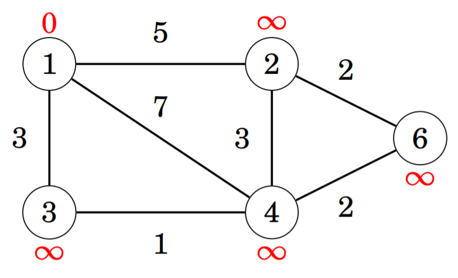
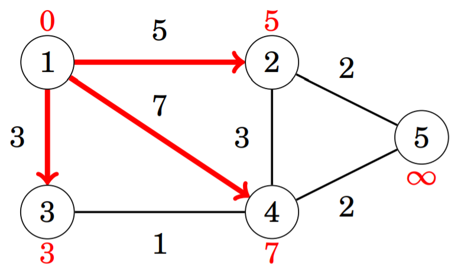
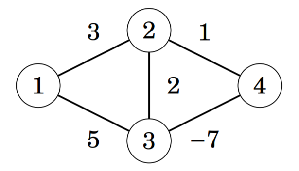

# 최단 경로

그래프 위에 있는 두 꼭짓점 사이의 거리를 계산하는 문제는 실생활에서 많은 이용이 가능하다. 그 예로는 도로의 
길이가 주어졌을 때 특정 도시로 갈 수 있는 최단 거리를 구하는 문제를 들 수가 있다. 비가중 그래프 (unweighted
graph)에서 경로의 길이는 간선의 길이가 되기 때문에 너비 우선 탐색 알고리즘을 이용해 쉽게 최단 거리를 구할 수
있다. 하지만 이번 장에서는 최단 거리를 찾는 데에 더 복잡한 알고리즘이 필요한 가중 그래프 (weighted graph)에 
집중하도록 한다.

## 벨만-포드 알고리즘

벨만-포드 알고리즘 (Bellman–Ford algorithm)은 시작 지점에서 그래프의 모든 꼭짓점 사이의 최단 거리를 구할 때
사용할 수 있다. 벨만-포드 알고리즘은 길이가 음수인 경로를 포함하는 순환 그래프를 제외한 모든 그래프를 처리할
수 있는데, 이 알고리즘은 맨 처음에 시작 지점과 다른 꼭짓점 사이의 거리를 모두 무한대 (∞)로 정한 다음, 그래프의
모든 간선을 거치며 거리를 계속 줄여나간다.

다음 그래프에서 벨만-포드 알고리즘이 어떻게 실행되는지 확인해보자.

먼저, 시작 지점에서 나가는 모든 간선을 거친다.

그 다음에는 아래와 같이 3개의 간선을 더 거치며 최단 거리를 찾는다.

이제 시작 지점에서 꼭짓점 `5`까지의 최단 거리를 확인해보자.

## SPFA

SPFA (Shorter Path Faster Algorithm)는 벨만-포드 알고리즘을 개선하여 조금 더 효율적으로 최단 거리를 계산할 수 있게
만든 알고리즘이다.

## 다익스트라 알고리즘

다익스트라 알고리즘 (Dijkstra's algorithm)은 벨만-포드 알고리즘처럼 시작 지점에서 그래프의 모든 꼭짓점을 거치며
최단 거리를 찾아낸다. 다익스트라 알고리즘은 벨만-포드 알고리즘보다 효율적이고 규모가 큰 그래프의 처리가 가능하다는 
장점이 있다.

## 플로이드-워셜 알고리즘

플로이드-워셜 알고리즘 (Floyd–Warshall algorithm)은 최단 경로를 찾을 수 있는 또다른 방법을 제공한다. 위에서 소개한
알고리즘과 다르게, 이 알고리즘은 꼭짓점 사이의 모든 최단 경로를 한번에 찾아낸다.