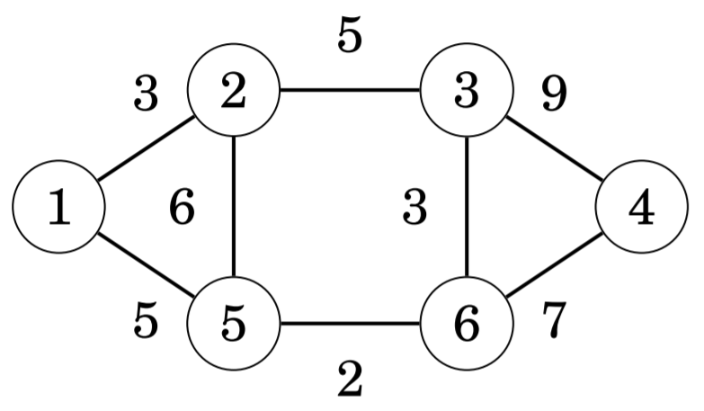
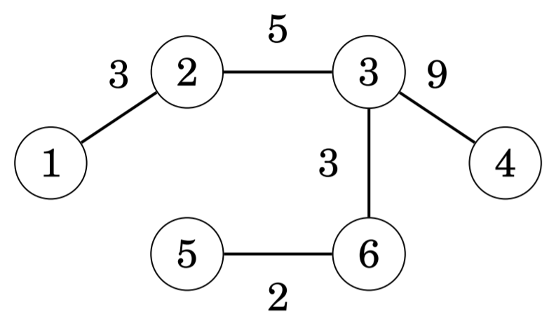
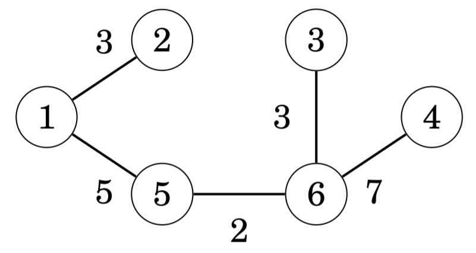
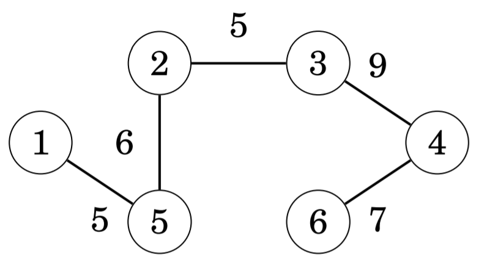

# 신장 트리

신장 트리 (spanning tree)는 그래프 위의 모든 꼭짓점을 연결한 트리를 의미한다. 신장 트리도 일반적인 트리와 마찬가지로
`n`개의 꼭짓점과 `n - 1`개의 간선으로 이루어져 있다. 예를 들어, 다음과 같은 그래프가 주어졌다고 하자.

그래프에서 3개의 간선을 없애면 아래와 같은 신장 트리가 만들어진다.

신장 트리의 가중치 (weight)는 트리의 모든 간선 가중치의 합으로, 위 그림에서 신장 트리의 가중치는 `3 + 5 + 9 + 3 + 2 = 22`
가 된다. 최소 신장 트리 (minimum spanning tree)와 최대 신장 트리 (maximum spanning tree)는 가중치가 각각 최소, 최대인 
신장 트리를 가리킨다. 맨 위의 가중 그래프 예시에서 최소 신장 트리와 최대 신장 트리를 찾아보자.

이번 장에서는 가중치에 따라 그래프의 간선을 거치며 최소 신장 트리를 찾는 두 개의 알고리즘에 대해 알아볼 것이다. 그래프의
간선을 거치는 순서를 거꾸로 하면 최대 신장 트리도 쉽게 구할 수 있다.

## 크러스컬 알고리즘

## 합집합 찾기 알고리즘

## 프림 알고리즘