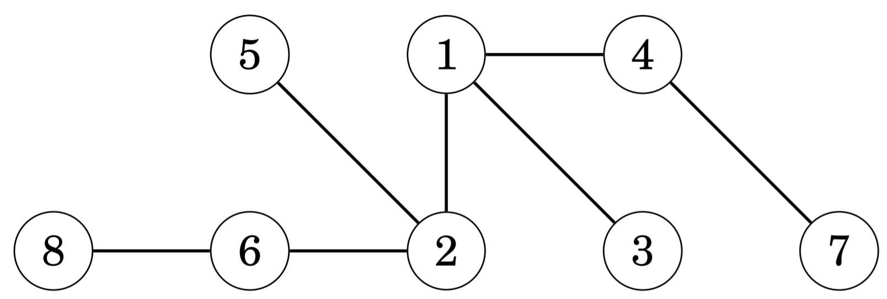
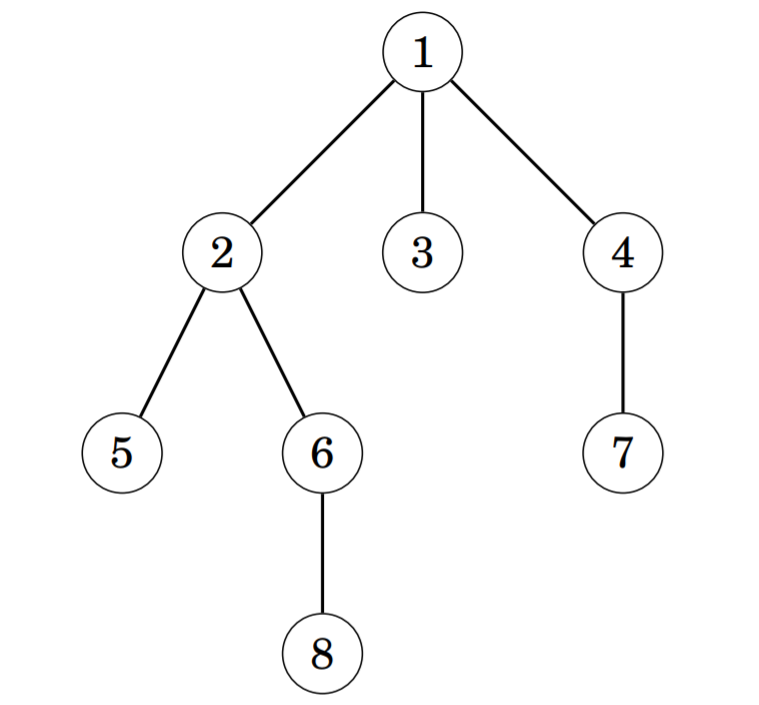
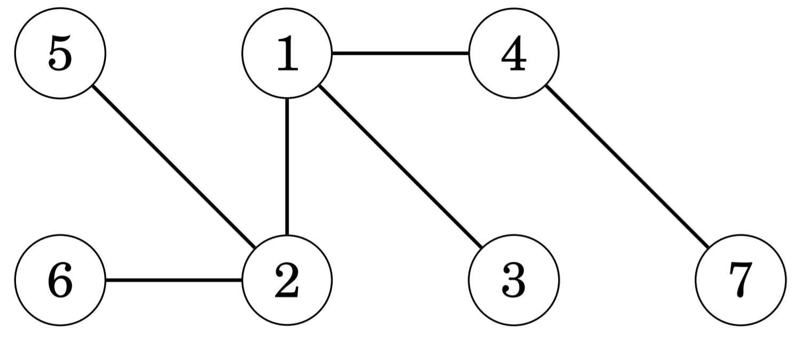
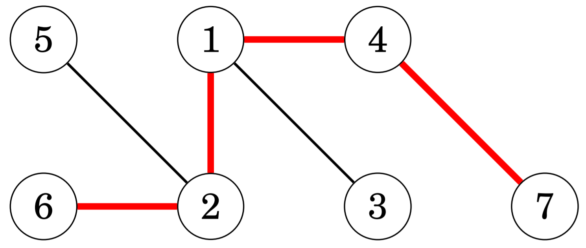
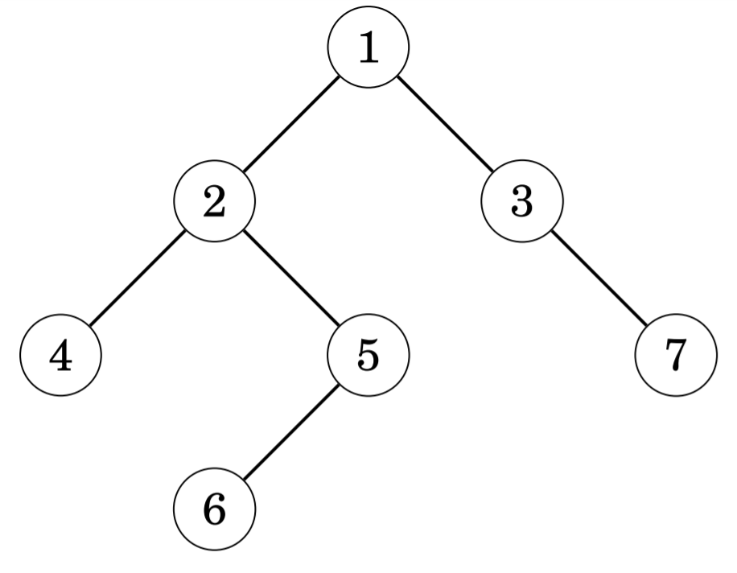

# 트리 알고리즘

트리 (tree)는 모든 꼭짓점이 연결되어 있으며, `n`개의 꼭짓점과 `n - 1`개의 간선으로 이루어진 비순환 그래프를 말한다.
하나의 트리에서 간선 하나를 없애면 두 개의 구성 요소가 되며, 트리에 간선 하나를 추가하면 순환하는 그래프가 된다. 
또한, 트리의 임의의 두 꼭짓점 사이는 항상 하나의 경로만을 통해 이동할 수 있다. 아래의 그림은 8개의 꼭짓점과 7개의
간선으로 이루어진 트리이다.

트리에서 차수가 1인 꼭짓점, 즉 이웃하는 꼭짓점이 단 1개인 꼭짓점을 잎 (leaf node)이라고 한다. 트리에서 가장 위에 있는
꼭짓점을 뿌리 (root node)라고 하는데, 트리는 뿌리의 유무에 따라 뿌리가 존재하는 트리 (rooted tree)와 뿌리가 존재하지
않는 트리 (unrooted tree)로 나눌 수 있다. 아래 그림에서 꼭짓점 `1`은 트리의 뿌리이다.

뿌리가 존재하는 트리에서는 단 하나의 뿌리 꼭짓점이 존재하고, 나머지 노드들은 뿌리 꼭짓점의 아래에 위치해 있다. 어떤
꼭짓점의 바로 위에 있는 이웃한 꼭짓점을 부모 (parent)라고 하고, 바로 아래에 있는 여러 개의 꼭짓점들을 자식 (children)
이라고 한다. 하나의 트리의 일부가 되는 또다른 트리를 서브 트리 (subtree)라고 한다. 위 그림에서 꼭짓점 `2`를 뿌리로
하는 서브 트리는 다음과 같이 꼭짓점 `2`를 포함한 4개의 꼭짓점으로 이루어져 있다.

## 트리 탐색하기

트리는 그래프의 일종이기 때문에, 트리를 탐색할 때에 일반적인 그래프 탐색 알고리즘을 사용할 수 있다. 트리는 무조건 하나의
방향에서만 특정 꼭짓점에 접근할 수 있고 비순환 그래프이기 때문에 탐색 알고리즘을 구현하기 매우 수월하다는 특징이 있다.

동적 계획법을 사용하면 그래프를 탐색하면서 각각의 꼭짓점을 뿌리로 하는 서브 트리의 모든 꼭짓점의 개수나, 어떤 꼭짓점에서 
하나의 잎 꼭짓점까지의 최장 길이 등, 그래프에 대한 특정 정보를 얻을 수 있다.

## 트리의 지름

트리의 지름 (diameter)은 두 꼭짓점 사이의 가장 긴 경로를 의미하며, 하나의 트리에는 여러 개의 지름이 존재할 수 있다.

예를 들어, 다음과 같은 트리가 있을 때,

이 트리의 지름은 4라는 것을 확인할 수 있다.

이제 트리의 지름을 구할 때 주로 사용되는 두 개의 알고리즘에 대해 알아보자. 두 알고리즘 모두 시간 복잡도는 `O(n)`이며,
첫 번째 알고리즘은 동적 계획법을 사용하고 두 번째 알고리즘은 깊이 우선 탐색 알고리즘을 사용한다.

## 이진 트리

각각의 꼭짓점이 2개 이하의 자식을 가지고 있는 트리를 이진 트리 (binary tree)라고 부른다.

